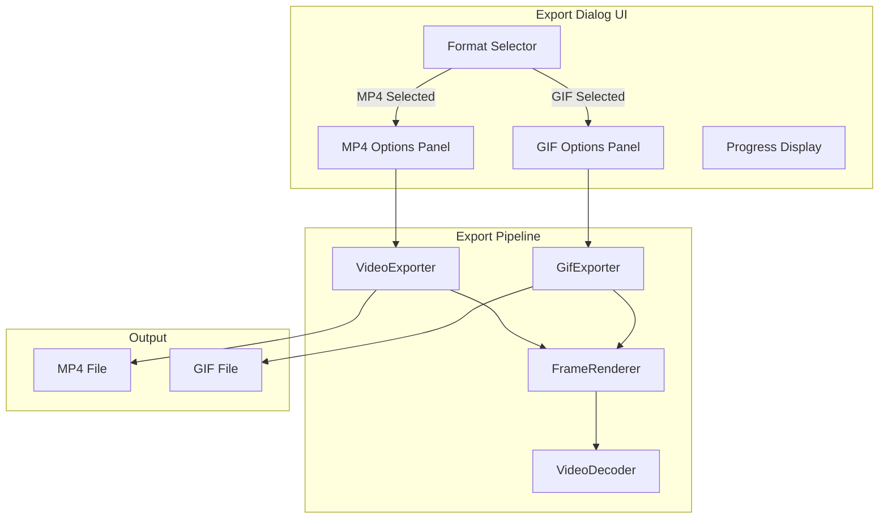
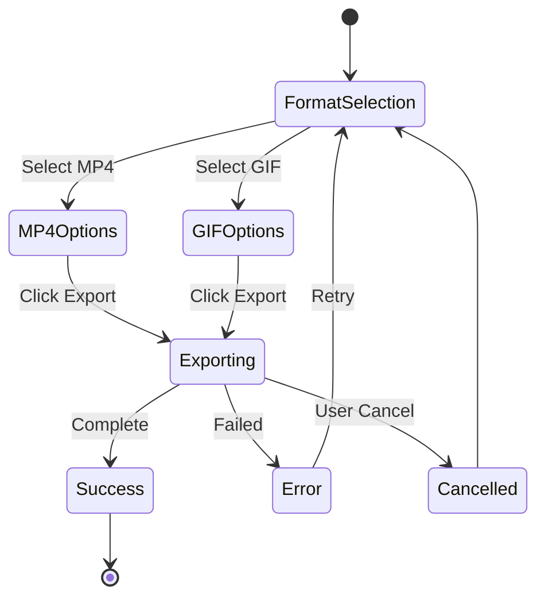
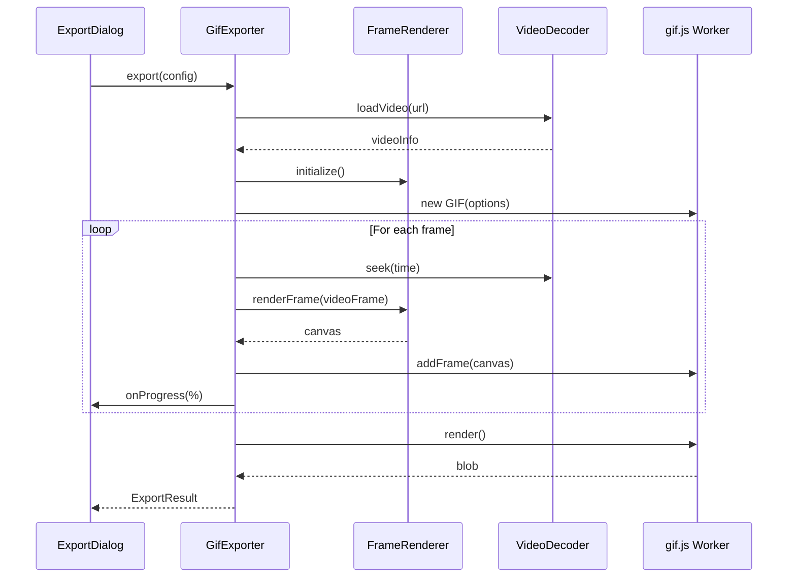

# Design Document: GIF Export Feature

## Overview

This design extends the existing video export system to support animated GIF output. The implementation introduces a new export format selection UI, a GIF encoder module using the `gif.js` library for client-side GIF encoding, and modifications to the existing export pipeline to support both MP4 and GIF workflows.

## Architecture



## Components and Interfaces

### 1. Export Format Types

```typescript
// src/lib/exporter/types.ts

export type ExportFormat = 'mp4' | 'gif';

export type GifFrameRate = 10 | 15 | 20 | 25 | 30;

export type GifSizePreset = 'small' | 'medium' | 'large' | 'original';

export interface GifExportConfig {
  frameRate: GifFrameRate;
  loop: boolean;
  sizePreset: GifSizePreset;
  width: number;
  height: number;
}

export interface ExportSettings {
  format: ExportFormat;
  // MP4 settings
  quality?: ExportQuality;
  // GIF settings
  gifConfig?: GifExportConfig;
}

export const GIF_SIZE_PRESETS: Record<GifSizePreset, { maxHeight: number; label: string }> = {
  small: { maxHeight: 480, label: 'Small (480p)' },
  medium: { maxHeight: 720, label: 'Medium (720p)' },
  large: { maxHeight: 1080, label: 'Large (1080p)' },
  original: { maxHeight: Infinity, label: 'Original' },
};

export const GIF_FRAME_RATES: { value: GifFrameRate; label: string }[] = [
  { value: 10, label: '10 FPS - Smaller file' },
  { value: 15, label: '15 FPS - Balanced' },
  { value: 20, label: '20 FPS - Smooth' },
  { value: 25, label: '25 FPS - Very smooth' },
  { value: 30, label: '30 FPS - Maximum' },
];
```

### 2. GIF Exporter Module

```typescript
// src/lib/exporter/gifExporter.ts

interface GifExporterConfig {
  videoUrl: string;
  width: number;
  height: number;
  frameRate: GifFrameRate;
  loop: boolean;
  wallpaper: string;
  zoomRegions: ZoomRegion[];
  trimRegions?: TrimRegion[];
  cropRegion: CropRegion;
  annotationRegions?: AnnotationRegion[];
  // ... other effect settings
  onProgress?: (progress: ExportProgress) => void;
}

export class GifExporter {
  private config: GifExporterConfig;
  private decoder: VideoFileDecoder | null = null;
  private renderer: FrameRenderer | null = null;
  private gif: GIF | null = null;
  private cancelled = false;

  constructor(config: GifExporterConfig);
  
  async export(): Promise<ExportResult>;
  cancel(): void;
  private cleanup(): void;
  private getEffectiveDuration(totalDuration: number): number;
  private mapEffectiveToSourceTime(effectiveTimeMs: number): number;
}
```

### 3. Export Dialog Component Updates

```typescript
// src/components/video-editor/ExportDialog.tsx

interface ExportDialogProps {
  isOpen: boolean;
  onClose: () => void;
  onExport: (settings: ExportSettings) => void;
  progress: ExportProgress | null;
  isExporting: boolean;
  error: string | null;
  onCancel?: () => void;
  aspectRatio: AspectRatio;
  sourceWidth: number;
  sourceHeight: number;
}

// Internal state
interface ExportDialogState {
  format: ExportFormat;
  quality: ExportQuality;
  gifFrameRate: GifFrameRate;
  gifLoop: boolean;
  gifSizePreset: GifSizePreset;
}
```

### 4. Format Selector Component

```typescript
// src/components/video-editor/FormatSelector.tsx

interface FormatSelectorProps {
  selectedFormat: ExportFormat;
  onFormatChange: (format: ExportFormat) => void;
  disabled?: boolean;
}
```

### 5. GIF Options Panel Component

```typescript
// src/components/video-editor/GifOptionsPanel.tsx

interface GifOptionsPanelProps {
  frameRate: GifFrameRate;
  onFrameRateChange: (rate: GifFrameRate) => void;
  loop: boolean;
  onLoopChange: (loop: boolean) => void;
  sizePreset: GifSizePreset;
  onSizePresetChange: (preset: GifSizePreset) => void;
  outputDimensions: { width: number; height: number };
  disabled?: boolean;
}
```

## Data Models

### Export Configuration Flow



### GIF Encoding Pipeline



## Correctness Properties

*A property is a characteristic or behavior that should hold true across all valid executions of a system—essentially, a formal statement about what the system should do. Properties serve as the bridge between human-readable specifications and machine-verifiable correctness guarantees.*

### Property 1: Valid Frame Rate Acceptance

*For any* frame rate value, the GIF_Exporter SHALL accept it if and only if it is one of the valid presets (10, 15, 20, 25, 30 FPS). Invalid frame rates should be rejected with an error.

**Validates: Requirements 2.2**

### Property 2: Loop Encoding Correctness

*For any* GIF export configuration, when loop is enabled the output GIF SHALL have a loop count of 0 (infinite), and when loop is disabled the output GIF SHALL have a loop count of 1 (play once).

**Validates: Requirements 3.2, 3.3**

### Property 3: Size Preset Resolution Mapping

*For any* valid size preset and source video dimensions, the GIF_Exporter SHALL produce output with height matching the preset's max height (or source height if smaller), with width calculated to maintain aspect ratio.

**Validates: Requirements 4.2**

### Property 4: Aspect Ratio Preservation

*For any* source video with aspect ratio R and any size preset, the exported GIF SHALL have an aspect ratio within 0.01 of R.

**Validates: Requirements 4.4**

### Property 5: Valid GIF Output

*For any* successful GIF export, the output blob SHALL be a valid GIF file that can be parsed by standard GIF decoders, containing the expected number of frames based on video duration and frame rate.

**Validates: Requirements 5.3**

### Property 6: Frame Count Consistency

*For any* video with effective duration D (excluding trim regions) and frame rate F, the exported GIF SHALL contain approximately D × F frames (within ±1 frame tolerance).

**Validates: Requirements 5.1**

### Property 7: MP4 Export Regression

*For any* valid MP4 export configuration that worked before this feature, the Video_Exporter SHALL continue to produce valid MP4 output with the same quality characteristics.

**Validates: Requirements 7.2**


## Error Handling

### GIF Export Errors

| Error Condition | Handling Strategy |
|----------------|-------------------|
| Video load failure | Display error message, allow retry |
| Frame rendering failure | Log error, skip frame, continue if possible |
| GIF encoding failure | Display error message with details |
| Memory exhaustion | Suggest smaller size preset or lower frame rate |
| User cancellation | Clean up resources, reset UI state |
| Invalid configuration | Validate before export, show validation errors |

### Error Messages

```typescript
const GIF_EXPORT_ERRORS = {
  VIDEO_LOAD_FAILED: 'Failed to load video. Please try again.',
  ENCODING_FAILED: 'GIF encoding failed. Try reducing size or frame rate.',
  MEMORY_ERROR: 'Not enough memory. Try a smaller size preset.',
  CANCELLED: 'Export cancelled.',
  INVALID_CONFIG: 'Invalid export configuration.',
};
```

## Testing Strategy

### Unit Tests

Unit tests will cover:
- GIF configuration validation (frame rate, size preset, loop settings)
- Dimension calculation for size presets
- Aspect ratio calculation and preservation
- Export settings serialization/deserialization
- UI component state management

### Property-Based Tests

Property-based tests will validate the correctness properties using fast-check:

1. **Frame Rate Validation Property**: Generate random integers, verify only valid frame rates are accepted
2. **Loop Encoding Property**: Generate random loop settings, verify GIF metadata matches
3. **Size Preset Property**: Generate random video dimensions and presets, verify output dimensions
4. **Aspect Ratio Property**: Generate random aspect ratios, verify preservation within tolerance
5. **Valid GIF Property**: Generate random export configs, verify output is parseable GIF
6. **Frame Count Property**: Generate random durations and frame rates, verify frame count

### Integration Tests

- End-to-end export flow for both MP4 and GIF
- Format switching in export dialog
- Progress reporting during export
- Cancellation handling
- Error recovery scenarios

### Test Configuration

```typescript
// Property test configuration
const PBT_CONFIG = {
  numRuns: 100,
  seed: Date.now(),
};
```

### Testing Library

- **Property-Based Testing**: fast-check (already available in the ecosystem)
- **Unit Testing**: Vitest (existing test framework)
- **Component Testing**: React Testing Library

## Implementation Notes

### GIF Library Selection

Using `gif.js` for client-side GIF encoding:
- Web Worker support for non-blocking encoding
- Configurable quality and dithering
- Frame delay control for variable frame rates
- Loop count configuration

### Performance Considerations

1. **Memory Management**: Process frames in batches to avoid memory exhaustion
2. **Worker Threads**: Use gif.js workers for parallel encoding
3. **Progress Reporting**: Report progress after each frame for responsive UI
4. **Cancellation**: Check cancelled flag between frames for quick abort

### File Size Estimation

Approximate GIF file size formula:
```
estimatedSize = width × height × frameCount × colorDepthFactor × compressionRatio
```

Where:
- colorDepthFactor ≈ 0.5 (for 256 colors with LZW compression)
- compressionRatio ≈ 0.3-0.7 (depends on content complexity)
